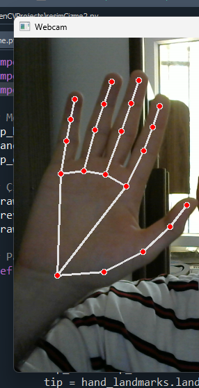

# Drawing with Finger Using Webcam

This project allows you to draw on a white background using your finger via webcam. It leverages MediaPipe and OpenCV libraries to track hand and finger movements and enables drawing when your finger is open.

## Features

- Tracks finger movements.
- Draws when the finger is open, stops when closed.
- Draws on a white background.
- Displays both the webcam feed and the drawing canvas.

## Requirements

- Python 3.x
- OpenCV
- MediaPipe

## Installation

Install the required libraries using the following commands:

```bash
pip install opencv-python mediapipe
```

## Usage

After cloning or downloading the project, run the `drawing_with_finger.py` file:

```bash
python drawing_with_finger.py
```

Once the program starts:

- The webcam feed will open, allowing you to draw on a white background.
- Open your fingers to start drawing and close them to stop.
- Press the `q` key to terminate the program.

## Example

Here is an example of the program in action:



## Contributing

If you would like to contribute, please submit a pull request or report any issues. All contributions and feedback are welcome!

## License

This project is licensed under the MIT License. For more information, see the `LICENSE` file.